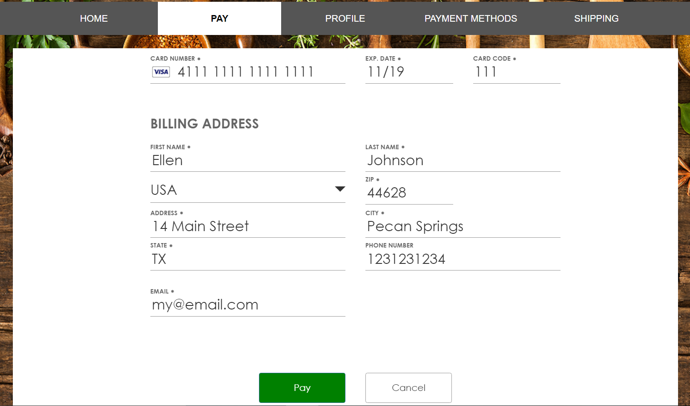

# Accept Hosted Step-by-Step
Accept Hosted provides a fully hosted payment transaction solution. Authorize.Net takes care of the payment form, the transaction itself and (optionally) the receipt generation.  This example demonstrates using an embedded iFrame to display the page, but you could also use a lightbox style popup iFrame.  See our [developer documentation](http://developer.authorize.net/api/reference/features/accept_hosted.html) for more details.  
Remember all these steps are reflected in this sample app which you can set up and run yourself.
  

## Step 1. Create a Secure Form Token

In this step we will request an Accept Hosted form token using the Authorize.Net API.  
You can try out the call in our sandbox API Explorer here:  http://developer.authorize.net/api/reference/#payment-transactions-get-an-accept-payment-page   
  
**NOTE: This should be a fully authenticated server-side call for your application, for example if you had a .NET application this call would be in the code-behind .cs files, for a mobile app this could be in your node.js backend, etc**  
  
In this Accept Sample application you can find the sample code in https://github.com/AuthorizeNet/accept-sample-app/blob/master/getHostedPaymentForm.php
  
With this method you can (1) specify how you want the payment form to look and behave, e.g. if it shows the Billing Address, text on the buttons, etc and (2) provide any information you want to be prepopulated on the form or passed along with the payment.  See the **Requesting a Token** section on our Feature Details page: http://developer.authorize.net/api/reference/features/accept_hosted.html
  
  
See below for an example of the output from getHostedPaymentPage method.  The important response data is the token element as you will use this for the next step:
  
````xml
<getHostedPaymentPageResponse>
  <messages>
    <resultCode>Ok</resultCode>
    <message>
      <code>I00001</code>
      <text>Successful.</text>
    </message>
  </messages>
  <token>
66oTeT0c6/r39pwCcfkNpcjF+I01JUvaULhkE3qWzfzOYbXu0xGbd+Toc5FGTK2WZFP0GbMRbLD7I3tkW2vLEwUkBSMn9WZcuCkNF/jzXi19To1sk+Z8K7aOHs04dhTF1el1qLC+eeWcOsZTYA8GioV6XTNMTQ7j6lLp9HZtci3541iRJET61/VMvhp1iTc5qbWJIAF/DwqxWS5JReAQP9NZE6hvwxJ2s4CpgQwAB8IidWsSpTE+n13otQd/DciRwsZCnz1oXmcqjKoaBoNm3HO0ZI2lDF13sJtBPa6wPB1gbIi/SoPGqY56Qu26VTHGTNlh6tXpda7q/L8sJtBw0oPLXqvhGthBD5JIzFOfQOvo24cgF6B88v2xOnYRkZPh+YeyngQ3z7d4vuouFrQkzQxbvoScA/JRbR09Z69CQ1xZyB0GZYBcPg8QPiWyhQ4sycS10W+hL5BeKqb6Sud1rIcZVmX7/YodESBjPUarjbLbLMJxDXtBobJ00UjNl2o0cFWllujS91qQCa3I2S0EO65m+5WH4YuFbYafoUSj7eCgI4Bm9jIYTYQpgJQ8GNPC1WcqDMhMxsr9R0PXj4tbUqwuizRyFQU7E86Jkhu/lGgvOUmKU/GobNZbgpTsvloMMrS39a/w6mk036Jz42CorSomAqTf9dEFqwA0T6KmEWcm/XplpaEEeoARHdX0x+n/GL5niAp3blDhbJubTyQDPQ6jqFP4NifhICcCFV2oVLcYhG1Hr70A+Y0HA+V58czHysQDu8RyV97Ssz7FY8nChFQXqpHzIhMdygliKx8+sizarzdDbX3KDjK5QhsYDk13xU4epF5X9L6lHMokEOuJ9UAoXZfxmuy3Uhs8tBkya3A+XFi+fIn/ilrJwOyMtMdm8iBVgs+CstNzH49rCWCrU5en4Yjt93tSqrCuNouvCbY=.89nE4Beh
  </token>
</getHostedPaymentPageResponse>
````
  
## Step 2. Incorporate Accept Hosted form into your payment flow.

In this step we will embed the payment form in a web page using an iFrame and complete the payment transaction.  
  
See our sample code, https://github.com/AuthorizeNet/accept-sample-app/blob/master/index.php 
  
  Here's an example of the iFrame which will contain the Accept Hosted page:
  ````html
  <iframe id="load_payment" class="embed-responsive-item" name="load_payment" width="100%" height="650px" frameborder="0" scrolling="no" hidden="true">
			</iframe>
 ````
  
  You could then load the Accept Hosted from into your iFrame like this:
  ````html
  <form id="send_hptoken" action="https://test.authorize.net/payment/payment" method="post" target="load_payment" >
				<input type="hidden" name="token" value="<?php echo $hostedPaymentResponse->token ?>" />
			</form>
  ````
  **NOTE:  The token passed to Accept Hosted is generated in Step 1 above.**
    
The Accept Hosted page should appear in your iFrame like this:
  
  
    
      
## Step 3.  Listen for Accept Hosted Messages.  
  
In this step we will demonstrate how to resize your container iFrame based on resize messages from the Accept Hosted form.  
To securely communicate between our Accept Hosted page and your web page we need a communicator page which will be hosted on your site alongside your checkout/payment page.  For example, in this sample application see https://github.com/AuthorizeNet/accept-sample-app/blob/master/iCommunicator.html. You can use this same communicator page in your application.

Pass the URL of your communicator page when you request a token (Step 1 above). For example:
  
````xml
		<setting>
			<settingName>hostedPaymentIFrameCommunicatorUrl</settingName>
			<settingValue>{"url":"https://www.mystore.com/checkout/iCommunicator.html"}</settingValue>
		</setting>
````
  
Once you have the communicator page in place, you can listen for the messages in your main page.  See index.php in our sample.  
  
An important message to receive is the **resizeWindow** message.  Because our Accept Hosted form is responsive we need to let your application know when the iFrame needs to be resized.  An example is when the form becomes single column, on a phone, therefore the height is increased and this height increase is passed on in a **ResizeWindow** message.  
  
In our sample below, you can see where the height parameter is checked and then the iFrame outerHeight is increased accordingly:  
  
````javascript
	CommunicationHandler.onReceiveCommunication = function (argument) {
		params = parseQueryString(argument.qstr)
		parentFrame = argument.parent.split('/')[4];
		console.log(params);
		console.log(parentFrame);
		//alert(params['height']);
		$frame = null;
		switch(parentFrame){
			case "manage" 		: $frame = $("#load_profile");break;
			case "payment"		: $frame = $("#load_payment");break;
		}
		switch(params['action']){
			case "resizeWindow" : if( parentFrame== "manage" && parseInt(params['height'])<1150) params['height']=1150;
					      if( parentFrame== "payment" && parseInt(params['height'])<1000) params['height']=1000;
					      $frame.outerHeight(parseInt(params['height']));
					      break;
````
  
  
## Step 4.  Display a custom receipt using the transaction response message.  
  
In this step we will receive the payment form response via the iFrameCommunicatorURL and use that response data to present a custom receipt.  
  
 Now that you have the communication all set up (Step 3) it is simple to receive the transactResponse message:  
   
 ````javascript
 case "transactResponse": 	
				$('#HostedPayment').attr('src','about:blank');
				var transResponse = JSON.parse(params['response']);
				$("#HPConfirmation p").html("<strong><b> Success.. !! </b></strong> <br><br> Your payment of <b>$"+transResponse.totalAmount+"</b> for <b>"+transResponse.orderDescription+"</b> has been Processed Successfully on <b>"+transResponse.dateTime+"</b>.<br><br>Generated Order Invoice Number is :  <b>"+transResponse.orderInvoiceNumber+"</b><br><br> Happy Shopping with us ..");
				$("#HPConfirmation p b").css({"font-size":"22px", "color":"green"});
				$("#HPConfirmation").modal("toggle");
 ````
   
 In the sample app we've used the data to present a simple confirmation and receipt dialog:  
   
 ````html
 <div class="modal fade" id="HPConfirmation" role="dialog">
    <div class="modal-dialog" style="display: inline-block; vertical-align: middle;">
       <div class="modal-content">
          <div class="modal-header">
	      <button id="closeAcceptConfirmationHeaderBtn" type="button" class="close" data-dismiss="modal">&times;</button>
	      <h4 class="modal-title"><b>Payment Confirmation</b></h4>
          </div>
	  <div class="modal-body" style="background-color: antiquewhite">
	       <p style="font-size: 16px; font-style: italic; padding:10px; color: #444; text-align: center"></p>
	  </div>
          <div class="modal-footer">
	     <button id="closeAcceptConfirmationFooterBtn" type="button" class="btn btn-success" data-dismiss="modal">Close</button>
          </div>
      </div> 
 </div>
 ````  
 
