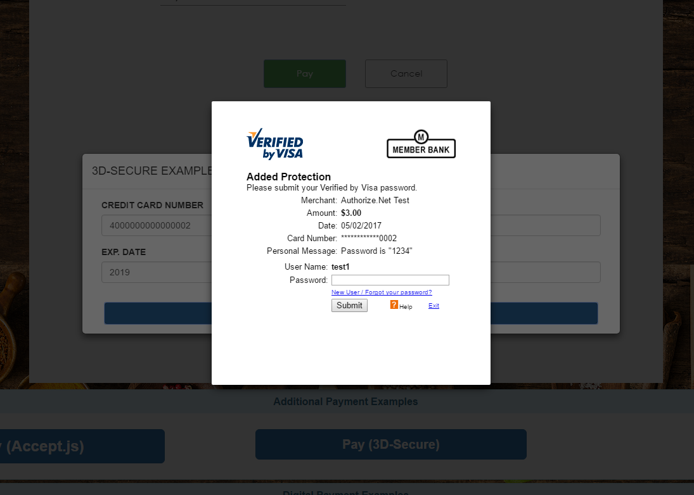

# Integrating 3D-Secure (Payer Authentication) with Cardinal Cruise . 

Authorize.Net supports authentication of the consumer/cardholder through the industry standard protocol of 3D-Secure (also known as Verified by Visa or MasterCard SecureCode).  
  
Cardinal Commerce provides a simple javascript library (Cardinal Cruise) to facilitate this consumer authentication and our sample application demonstrates the integration of Cardinal Cruise with Authorize.Net Accept.js and the Authorize.Net payment API.

This step-by-step guide walks through our sample code which is initiated with the Pay (3D-Secure) button on our main index.php page, Pay tab.
The sample code is primarily in the following 2 files:

https://github.com/AuthorizeNet/accept-sample-app/blob/master/payerAuthCaller.js 
https://github.com/AuthorizeNet/accept-sample-app/blob/master/generateCardinalJWT.php

## Step 1. Initialize Cardinal Cruise.

  
## Step 2. Retrieve a Cardinal Cruise JWT from your server.

      
## Step 3.  Start the Consumer Authentication Flow.
  
 
  
## Step 4.  Receive the response from Cardinal Cruise  
  
  
## Step 5.  Call Accept.js to dispatch card data to Authorize.Net

## Step 6.  Complete the payment
 
